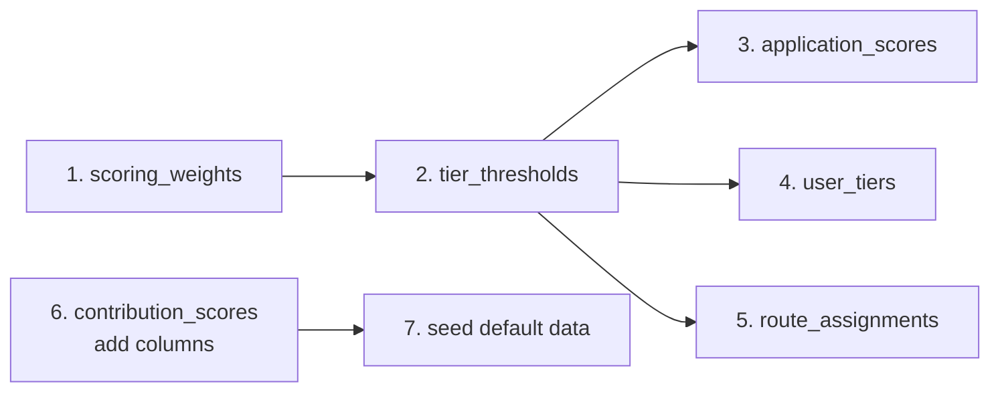

# Phase 2 — Scoring Engine Architecture Design

> **Status:** Draft · **Target:** Phase 2 implementation after Entry Control Layer (Phase 1) is hardened
> **Audience:** Engineering team · **Last updated:** May 2026

---

## Table of Contents

1. [Executive Summary](#1-executive-summary)
2. [Design Principles](#2-design-principles)
3. [System Architecture Overview](#3-system-architecture-overview)
4. [Scoring Pipeline](#4-scoring-pipeline)
5. [Application Scoring Engine (NEW)](#5-application-scoring-engine-new)
6. [Contributor Scoring Engine (ENHANCE)](#6-contributor-scoring-engine-enhance)
7. [Tier System (NEW)](#7-tier-system-new)
8. [Routing Engine (NEW)](#8-routing-engine-new)
9. [Data Model Changes](#9-data-model-changes)
10. [API Endpoints (NEW)](#10-api-endpoints-new)
11. [Cron Jobs & Scheduling](#11-cron-jobs--scheduling)
12. [Rollout Strategy](#12-rollout-strategy)
13. [Open Questions & Decisions](#13-open-questions--decisions)

---

## 1. Executive Summary

Phase 1 (Entry Control Layer) funnels applicants through a prefilter → intake form → Veronica gatekeeper scan. Phase 2 builds on that foundation by introducing **structured scoring** at every stage:

| Stage | What gets scored | Purpose |
|-------|------------------|---------|
| **Application** | New `entry_intake` submissions | Automatically route applicants to the right path |
| **Contribution** | Verified `activity_event` records (enhanced) | Fairly distribute ownership & recognize impact |
| **Tier** | Aggregated user score across cycles | Gate access, voting weight, and visibility |
| **Routing** | Application score + intent type | Direct to onboarding, VC intro, or partnership |

**Goal:** Each scoring stage is *additive* (does not modify Phase 1 tables or existing API contracts) and can be shipped independently.

---

## 2. Design Principles

1. **No retroactive scoring** — only score new data created after Phase 2 goes live.
2. **Rule-based first, AI later** — start with deterministic formulas; iterate toward AI enhancement.
3. **Fail safe** — scoring errors never block intake or activity verification.
4. **Auditable** — every score computation is logged (who, what, when, which inputs).
5. **Configurable weights** — admin-configurable `ContributionWeight` and `ScoringWeight` tables.
6. **Idempotent** — re-running scoring produces the same result for the same data.
7. **Phase 1 untouched** — no changes to `entry_intake`, `event_logs`, or `gatekeeper_reviews`.

---

## 3. System Architecture Overview

```
┌─────────────────────────────────────────────────────────────────────┐
│                        PHASE 2 SCORING ENGINE                       │
│                                                                     │
│  ┌─────────────┐   ┌──────────────┐   ┌────────────┐   ┌────────┐ │
│  │ Application │──▶│ Contributor  │──▶│    Tier     │──▶│Routing │ │
│  │   Scoring   │   │   Scoring    │   │   Scoring   │   │Engine  │ │
│  └─────────────┘   └──────────────┘   └────────────┘   └────────┘ │
│         │                  │                  │                    │
│         ▼                  ▼                  ▼                    │
│  ┌─────────────┐   ┌──────────────┐   ┌────────────┐              │
│  │AppScore     │   │ContribScore  │   │UserTier    │              │
│  │(new table)  │   │(new fields)  │   │(new table) │              │
│  └─────────────┘   └──────────────┘   └────────────┘              │
└─────────────────────────────────────────────────────────────────────┘
         │                    │                   │
         ▼                    ▼                   ▼
┌──────────────────────────────────────────────────────────────────────┐
│                      EXISTING PHASE 1 DATA                           │
│  entry_intake · event_logs · gatekeeper_reviews · activity_events    │
│  contribution_scores · ownership_ledger · contributor_reputation     │
└──────────────────────────────────────────────────────────────────────┘
```

### Key integration points with existing services

| Existing Service | Phase 2 Integration |
|---|---|
| `contributionScoreService` | Extended with new weight dimensions (quality, consistency, impact) |
| `ownershipService` | Consumes enhanced scores for better ownership distribution |
| `reputationService` | Reputation becomes one input to Tier scoring |
| `gatekeeperEnforcementService` | Unchanged — gatekeeper still controls admin action flow |
| `veronicaService` | Veronica score becomes one input to Application Scoring |

---

## 4. Scoring Pipeline

All four scoring stages follow the same pipeline pattern:

```
┌──────────┐   ┌──────────┐   ┌──────────┐   ┌──────────┐   ┌──────────┐
│ Trigger  │──▶│ Load     │──▶│ Compute  │──▶│ Persist  │──▶│ Notify   │
│ (event / │   │ Inputs   │   │ Score    │   │ Result   │   │ (if      │
│  cron)   │   │          │   │          │   │          │   │ changed) │
└──────────┘   └──────────┘   └──────────┘   └──────────┘   └──────────┘
```

**Triggers:**
- **Event-driven:** Fire scoring on specific domain events (intake submitted, activity verified)
- **Cron-driven:** Periodic recomputation (hourly/daily) to catch batch updates and decay

**Observability:**
- Each scoring run writes a `system_log` entry with `event: 'scoring_run'`, severity `INFO`
- Failed runs write severity `ERROR` with the failure reason
- Score changes above a threshold (e.g., >5% change) trigger notifications

---

## 5. Application Scoring Engine (NEW)

### Purpose
Score new `entry_intake` submissions to automatically determine:
- Is this applicant high-potential (fast track)?
- Is this applicant a good fit (standard path)?
- Does this applicant need additional screening?

### Inputs

| Field | Source | Type | Notes |
|-------|--------|------|-------|
| `intentType` | `entry_intake.intentType` | enum | join, collaborate, invest, propose, other |
| `capitalRange` | `entry_intake.capitalRange` | string | E.g. "$10k–$50k", "$50k–$250k", "$250k+" |
| `executionProofUrl` | `entry_intake.executionProofUrl` | string | Has URL? Has content? |
| `executionOutcome` | `entry_intake.executionOutcome` | string | Length, quality signals |
| `executionRecency` | `entry_intake.executionRecency` | string | Recently executed? |
| `valueProposition` | `entry_intake.valueProposition` | string | Length, keyword signals |
| `availability` | `entry_intake.availability` | string | High, medium, low |
| `veronicaScore` | `gatekeeper_review.veronicaScore` | float | 0.0–1.0 from Veronica scan |
| `veronicaFlags` | `gatekeeper_review.veronicaFlags` | string[] | Copy-paste detected? Gibberish? |

### Formula

```
applicationScore =
    (intentWeight   × intentScore)       +
    (capitalWeight  × capitalScore)      +
    (executionWeight × executionScore)   +
    (vpWeight       × vpScore)           +
    (availabilityWeight × availabilityScore) +
    (veronicaWeight  × veronicaScore)

totalScore = applicationScore / sumOfWeights  (normalize to 0–1)
```

#### Sub-score definitions

| Sub-score | Logic | Range |
|-----------|-------|-------|
| `intentScore` | `join/collaborate` → 0.8, `invest/propose` → 0.9, `other` → 0.3 | 0.0–1.0 |
| `capitalScore` | `"250k+"` → 1.0, `"50k–250k"` → 0.7, `"10k–50k"` → 0.4, null → 0.3 | 0.0–1.0 |
| `executionScore` | Has both URL and outcome text ≥ 50 chars → 0.9, has URL + short → 0.6, missing → 0.2 | 0.0–1.0 |
| `vpScore` | Length-based: >200 chars → 0.9, >100 chars → 0.7, >50 chars → 0.5, <50 → 0.2 | 0.0–1.0 |
| `availabilityScore` | `"full-time"` → 1.0, `"part-time"` → 0.6, other/null → 0.3 | 0.0–1.0 |
| `veronicaScore` | Pass-through from `gatekeeper_review.veronicaScore` (0 = not scanned yet ⇒ 0.5) | 0.0–1.0 |

#### Default weights (admin-configurable)

| Weight | Default | Description |
|--------|---------|-------------|
| `intentWeight` | 1.0 | Intent type importance |
| `capitalWeight` | 0.5 | Capital commitment importance |
| `executionWeight` | 2.0 | Prior execution track record importance |
| `vpWeight` | 1.5 | Value proposition quality importance |
| `availabilityWeight` | 0.8 | Time commitment importance |
| `veronicaWeight` | 1.2 | AI gatekeeper score importance |

### Routing thresholds

| Score Range | Route | Action |
|-------------|-------|--------|
| ≥ 0.75 | **Fast track** | Auto-advance to onboarding, skip gatekeeper queue |
| 0.40 – 0.74 | **Standard** | Gatekeeper review (existing flow) |
| < 0.40 | **Hold** | Additional screening required, flag for founder review |

### Implementation sketch

```typescript
// backend/src/services/scoring/applicationScoringService.ts

interface ApplicationScoreResult {
  entryIntakeId: string;
  totalScore: number;       // 0.0–1.0 normalized
  subScores: {
    intent: number;
    capital: number;
    execution: number;
    valueProposition: number;
    availability: number;
    veronica: number;
  };
  weights: Record<string, number>;  // snapshot used
  route: 'fast_track' | 'standard' | 'hold';
  scoredAt: Date;
}

async function scoreApplication(intakeId: string): Promise<ApplicationScoreResult> {
  const intake = await prisma.entryIntake.findUnique({ where: { id: intakeId } });
  const review = await prisma.gatekeeperReview.findFirst({
    where: { entityId: intakeId, entityType: 'user_intake' },
    orderBy: { createdAt: 'desc' },
  });
  const weights = await getActiveScoringWeights(); // from ScoringWeight table

  // Compute sub-scores...
  // Persist to ApplicationScore table...
  // Log to system_logs...
  // Return result...
}
```

### New table: `ApplicationScore`

```prisma
model ApplicationScore {
  id              String   @id @default(cuid())
  entryIntakeId   String   @unique
  totalScore      Float    @default(0.0)
  intentScore     Float    @default(0.0)
  capitalScore    Float    @default(0.0)
  executionScore  Float    @default(0.0)
  vpScore         Float    @default(0.0)
  availabilityScore Float  @default(0.0)
  veronicaScore   Float    @default(0.0)
  weightSnapshot  String   // JSON — which weights were used
  routeTag        String   // fast_track | standard | hold
  scoredAt        DateTime @default(now())
  recomputedAt    DateTime @updatedAt

  @@map("application_scores")
}
```

---

## 6. Contributor Scoring Engine (ENHANCE)

### Current state

`contributionScoreService.ts` already computes:
```
scoreContribution = contributionWeight × hoursFactor × timeDecay
```

Where:
- `contributionWeight` = weight from `ContributionWeight` table (code=1.0, review=0.7, etc.)
- `hoursFactor` = `1 + log(1 + hoursLogged) / log(5)` (diminishing returns)
- `timeDecay` = `e^(-decayRate × daysSinceActivity)` (exponential decay)

### Phase 2 enhancements

Add **three new dimensions** to the existing formula:

```
enhancedScore = baseScore × qualityMultiplier × consistencyBonus × impactMultiplier
```

| Dimension | Signal | Source | Effect |
|-----------|--------|--------|--------|
| **Quality** | Veronica approval status | `gatekeeper_review.status` | VALID → 1.2x, NEEDS_REVIEW → 1.0x, FLAGGED → 0.5x |
| **Consistency** | Activity frequency over last 30 days | `activity_events` count | > 8 activities/mo → 1.3x, 4–8 → 1.1x, < 4 → 1.0x |
| **Impact** | Peer feedback + task completion | `disputes` + `tasks` | Approved tasks → 1.1x, disputes won → 0.9x |

### New field on `ContributionScore`

```prisma
model ContributionScore {
  // ... existing fields ...
  qualityMultiplier    Float    @default(1.0)  // NEW
  consistencyBonus     Float    @default(1.0)  // NEW
  impactMultiplier     Float    @default(1.0)  // NEW
  enhancedScore        Float?   // NEW — null until Phase 2 is active
}
```

### Migration approach

1. Add nullable `enhancedScore` field to `contribution_scores`
2. Create new `computeEnhancedScore()` function that wraps existing `computeActivityScore()`
3. The cron job first computes `scoreContribution` (existing), then `enhancedScore` (new)
4. All existing consumers of `scoreContribution` continue to work unchanged
5. Phase 2 consumers start reading `enhancedScore` when non-null

---

## 7. Tier System (NEW)

### Purpose
Map aggregated user performance to a **tier level** that gates:
- Access to premium features
- Voting weight in governance
- Visibility on leaderboards
- Ownership pool distribution share

### Current frontend (already exists)

`TierBadge.tsx` defines 5 tiers:
- **founder** — Full platform access & governance rights
- **core** — Significant ownership stake & voting weight
- **contributor** — Active participant earning ownership
- **employee** — Salaried team member
- **observer** — Read-only access

`deriveTier(role?, effectiveOwnership?)` currently uses a simple role + ownership % mapping.

### Phase 2 enhancement

Replace hardcoded `deriveTier()` with a **data-driven tier engine** that considers:

| Input | Weight | Source |
|-------|--------|--------|
| `effectiveOwnership` | 3.0 | `ownershipService.calculateEffectiveOwnership()` |
| `contributionScore` | 2.0 | `ContributionScore.enhancedScore` |
| `reputationScore` | 1.5 | `ContributorReputation.reputationScore` |
| `cycleCount` | 1.0 | `CycleParticipation` count (opted-in) |
| `veronicaScore` | 0.5 | Average of recent gatekeeper reviews |

### Formula

```
tierScore =
    (ownershipWeight   × normalizedOwnership)   +
    (contributionWeight × normalizedContribution) +
    (reputationWeight  × normalizedReputation)   +
    (cycleWeight       × normalizedCycles)       +
    (veronicaWeight    × normalizedVeronica)
```

### Tier thresholds

| Tier | Min Score | Requirements |
|------|-----------|--------------|
| **founder** | 80 (admin-assigned only) | Cannot be earned through scoring alone |
| **core** | 60 | Must also have ≥ 3 completed cycles |
| **contributor** | 30 | Active participation (last activity < 30 days) |
| **employee** | N/A | Role-based, not score-based |
| **observer** | < 30 | Default for new/inactive users |

### New table: `UserTier`

```prisma
model UserTier {
  id            String   @id @default(cuid())
  userId        String   @unique
  tier          String   // founder | core | contributor | employee | observer
  tierScore     Float    @default(0.0)
  componentScores String? // JSON — breakdown of each input
  assignedAt    DateTime @default(now())
  updatedAt     DateTime @updatedAt

  user User @relation(fields: [userId], references: [id], onDelete: Cascade)

  @@map("user_tiers")
}
```

### New config table: `TierThreshold`

```prisma
model TierThreshold {
  id          String   @id @default(cuid())
  tier        String   @unique // founder | core | contributor | employee | observer
  minScore    Float    @default(0.0)
  minCycles   Int      @default(0)
  description String?
  isActive    Boolean  @default(true)
  updatedAt   DateTime @updatedAt

  @@map("tier_thresholds")
}
```

### Tier evaluation cron

Runs **hourly** (after normalization job) to reevaluate all active users:

```typescript
// backend/src/jobs/tierEvaluationJob.ts
async function runTierEvaluation() {
  // 1. Load all active users
  // 2. Compute tierScore for each user
  // 3. Map to tier based on thresholds
  // 4. Upsert to UserTier
  // 5. Log changes (especially downgrades)
  // 6. Notify users on tier changes (upgrade = celebration, downgrade = warning)
}
```

---

## 8. Routing Engine (NEW)

### Purpose
After scoring an application, automatically route it to the appropriate team or queue:

| Route | Condition | Action |
|-------|-----------|--------|
| **Onboarding** | Fast track (`score ≥ 0.75`) | Auto-create user, assign to default group, send welcome email |
| **Gatekeeper** | Standard (`0.40–0.74`) | Leave in gatekeeper queue (existing Phase 1 flow) |
| **Founder review** | Hold (`< 0.40`) or `intentType = 'invest'` with capital ≥ 250k | Notify founder/s, flag for manual review |
| **VC intro** | `intentType = 'invest'` with capital > 50k AND high execution score | Add to investor pipeline queue |

### Implementation

The routing engine is a **lightweight decision service** (not a separate system):

```typescript
// backend/src/services/scoring/routingService.ts
interface RoutingDecision {
  route: 'onboarding' | 'gatekeeper' | 'founder_review' | 'vc_intro';
  priority: 'high' | 'normal' | 'low';
  reason: string;
  notifyUserIds: string[]; // which admins/founders to notify
}
```

Routing triggers **after** application scoring completes (in the same `POST /api/triage/intake` response or as a fire-and-forget job).

### New table: `RouteAssignment`

```prisma
model RouteAssignment {
  id            String   @id @default(cuid())
  entryIntakeId String   @unique
  route         String   // onboarding | gatekeeper | founder_review | vc_intro
  priority      String   // high | normal | low
  reason        String?
  resolvedAt    DateTime?
  resolvedBy    String?
  createdAt     DateTime @default(now())

  @@map("route_assignments")
}
```

---

## 9. Data Model Changes

### Summary of new tables

| Table | Purpose | Depends on |
|-------|---------|------------|
| `application_scores` | Per-intake application scores | Phase 1 entry_intake |
| `user_tiers` | Per-user tier assignments | Phase 2 contribution scoring |
| `tier_thresholds` | Configurable tier cutoffs | Admin UI |
| `route_assignments` | Routing decisions per intake | Phase 2 application scoring |
| `scoring_weights` | Configurable scoring weights | Admin UI |

### Summary of enhanced tables

| Table | New fields | Backward compatible? |
|-------|------------|---------------------|
| `contribution_scores` | `qualityMultiplier`, `consistencyBonus`, `impactMultiplier`, `enhancedScore` | Yes — all nullable, default null |
| `notification` types | New types: `tier_upgraded`, `tier_downgraded`, `route_assigned` | Yes — type field is string |

### Prisma migration order



Each migration is reversible (additive columns only, no destructive changes).

---

## 10. API Endpoints (NEW)

### Application Scoring

| Method | Path | Auth | Description |
|--------|------|------|-------------|
| `GET` | `/api/scoring/applications/:id` | admin/founder | Get application score breakdown |
| `POST` | `/api/scoring/applications/:id/recompute` | admin/founder | Force recompute application score |
| `GET` | `/api/scoring/applications` | admin/founder | List all application scores (paginated, filterable) |
| `GET` | `/api/scoring/weights` | admin/founder | Get active scoring weights |
| `PUT` | `/api/scoring/weights` | founder | Update scoring weights |

### Tier System

| Method | Path | Auth | Description |
|--------|------|------|-------------|
| `GET` | `/api/scoring/tiers/me` | authenticated | Get current user's tier |
| `GET` | `/api/scoring/tiers/:userId` | admin/founder | Get any user's tier |
| `GET` | `/api/scoring/tiers` | authenticated | List all active tiers (config) |
| `PUT` | `/api/scoring/tiers/thresholds` | founder | Update tier thresholds |
| `GET` | `/api/scoring/tiers/leaderboard` | authenticated | Tier-based leaderboard |

### Routing

| Method | Path | Auth | Description |
|--------|------|------|-------------|
| `GET` | `/api/scoring/routes` | admin/founder | List route assignments (filterable) |
| `POST` | `/api/scoring/routes/:id/resolve` | admin/founder | Mark a route assignment as resolved |

---

## 11. Cron Jobs & Scheduling

Add to `scheduler.ts`:

| Job | Schedule | Purpose |
|-----|----------|---------|
| `ApplicationScoringJob` | On intake submit (event) + every 15 min | Score new intake submissions |
| `TierEvaluationJob` | Every hour (after normalization) | Reevaluate user tiers |
| `TierNotificationJob` | Every hour (after tier eval) | Notify on tier changes |
| `RouteResolutionJob` | Every 30 min | Auto-resolve stale route assignments |

### Integration with existing schedule

```
:00  Stall Evaluator
:15  Score Computation  ◄── enhanced with quality/consistency/impact
:20  Aggregation        ◄── consumes enhanced scores
:25  Normalization      ◄── consumes enhanced scores
:30  Tier Evaluation    ◄── NEW — after normalization
:35  Tier Notification  ◄── NEW — after tier evaluation
:45  Application Scoring ◄── NEW — periodic batch scoring
```

---

## 12. Rollout Strategy

### Phase 2a — Scoring Foundation (Week 1)
- [ ] Create `scoring_weights` and `tier_thresholds` tables
- [ ] Create `ApplicationScoreService` with rule-based formula
- [ ] Create `application_scores` table
- [ ] Add scoring to `POST /api/triage/intake` response (fire-and-forget)
- [ ] Seed default weights and thresholds
- [ ] Tests: scoring formula unit tests, integration test with intake flow

### Phase 2b — Tier System (Week 2)
- [ ] Create `user_tiers` table
- [ ] Create `TierEvaluationJob`
- [ ] Enhance `ContributionScoreService` with quality/consistency/impact multipliers
- [ ] Add `enhancedScore` column to `contribution_scores`
- [ ] Update `deriveTier()` frontend to use API data when available
- [ ] Tests: tier evaluation tests, tier transition tests

### Phase 2c — Routing Engine (Week 3)
- [ ] Create `route_assignments` table
- [ ] Create `RoutingService`
- [ ] Wire routing into intake submission flow
- [ ] Create founder notification system for hold/investor routes
- [ ] Tests: routing decision tests, notification integration tests

### Phase 2d — Admin UI & Iteration (Week 4)
- [ ] Admin UI for weight configuration
- [ ] Admin UI for tier threshold configuration
- [ ] Score breakdown visualization (radar chart)
- [ ] Leaderboard page
- [ ] Performance benchmarking

### Stretch goals
- AI-enhanced application scoring (Veronica provides score components directly)
- Time-decayed tier scoring (tier decays slowly without activity)
- Team-level aggregate scoring

---

## 13. Open Questions & Decisions

| # | Question | Options | Recommendation |
|---|----------|---------|----------------|
| 1 | Should application scoring be synchronous (block intake) or async? | Blocking / Fire-and-forget / Hybrid | **Fire-and-forget** — scoring failure should never block intake |
| 2 | Should tier demotions trigger immediate notifications? | Yes / No / Digest | **Yes** for demotions, **digest** for promotions (celebrate in batch) |
| 3 | Should scoring weights be global or per-cycle? | Global / Per-cycle | **Global** for v1, **per-cycle** as stretch goal |
| 4 | Should historical intake records be retro-scored? | Yes / No | **No** — only score new submissions after Phase 2 activation date |
| 5 | How should `veronicaScore` be handled when `gatekeeper_review` doesn't exist yet? | Default 0.5 / Wait for scan / Skip scoring | **Skip scoring** — score after Veronica scan completes (fire-and-forget chain) |
| 6 | Should we store sub-score breakdowns or just the final score? | Both | **Both** — breakdown is essential for auditability and debugging |
| 7 | How should the founder tier be handled (admin-assigned only)? | DB constraint / Code check / Both | **Both** — `tier_thresholds` has `isActive` flag per tier, code prevents auto-assignment of founder |

---

## Appendix A: Dependency Graph

```
entry_intake (Phase 1)
    │
    ├──▶ Application Scoring (Phase 2a)
    │       │
    │       └──▶ Route Assignment (Phase 2c)
    │
    ├──▶ Veronica Scan (Phase 1, fire-and-forget)
    │       │
    │       └──▶ (provides input to Application Scoring)
    │
    └──▶ Gatekeeper Review (Phase 1)

activity_events (Phase 1)
    │
    ├──▶ Contribution Scoring (Phase 1)
    │       │
    │       └──▶ Enhanced Contribution Scoring (Phase 2b)
    │
    └──▶ Ownership Service (Phase 1)

Contribution Score + Reputation + Ownership
    │
    └──▶ Tier Evaluation (Phase 2b)
```

## Appendix B: Error Handling Strategy

| Scenario | Behavior |
|----------|----------|
| Scoring weights table empty | Use hardcoded defaults, log warning |
| Application score computation fails | Log error, do not block intake response |
| Tier evaluation fails for one user | Log error, continue with next user |
| Duplicate score computation (idempotent) | Upsert — overwrite with latest result |
| Missing input data (e.g., no Veronica score) | Use safe default (0.5), log warning |
| Weight config changes mid-cycle | Next cron run picks up new weights; no retroactive scoring |
